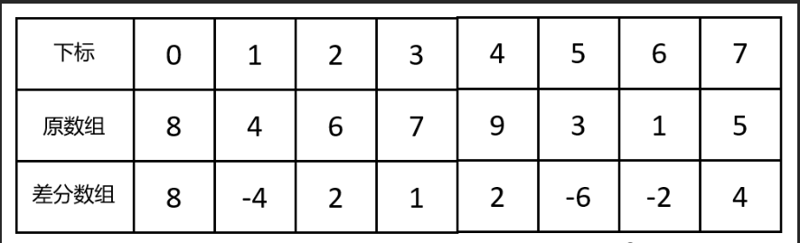
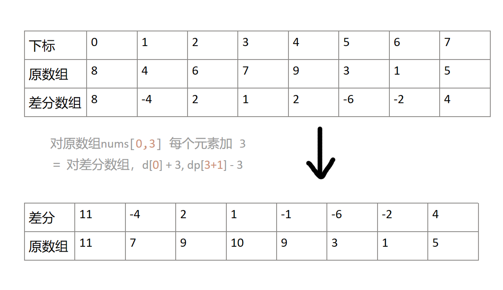

# 前缀和算法

## 差分数组、前缀和数组

### 一维数组

**一维差分数组（difference array）**

差分数组**性质**：

1. 从左到右累加 d 中的元素，可以得到原数组 nums
2. 如下两个操作是等价的
    - 把 nums 的子数组 a[i],a[i+1],⋯,a[j] 都加上 x。
    - 把 d[i] 增加 x，把 d[j+1] 减少 x。

所以利用性质 2，我们只需要 O(1) 的时间就可以完成对 sums 的子数组的操作

差分数组原理：

背景：假设给你一个数组 nums ，先对区间 [a,b] 中每个元素加 3 ，再对区间 [c,d] 每个元素减 5 …… ，这样非常频繁的区间修改，常规的做法可以一个个计算。
但是，频繁对数组的一段区间进行增加或减去同一个值，如果一个个去操作，效率会很差。

所以我们可以使用差分数组，**差分数组就是原始数组相邻元素之间的差**。

差分数组d[n]定义：d[i] = nums[i] - nums[i-1], 其中d[0] = nums[0]。
以下图为例



我们可以看到，如果从左到右累加 d 中的元素，我们就还原了nums，所以原数组就是差分数组的前缀和。

```cpp
nums[0] = d[0];
nums[3] = d[0] + d[1] + d[2] + d[3];
```

有了差分数组，如果对区间 [a,b] 每个元素加 3 ，不需要对nums中连续的子数组进行操作，只需要在两端修改即可，如下图所示。

```cpp
d[a] += 3;
d[b+1] -= 3;
```


**一维前缀和数组**

这个我们接触了很多，就是对原数组做前缀和。适用于需要快速求出 nums 子数组（区间）的和。

> 另外一种理解方式：前缀和差分相当于积分和导数的关系，差分的前缀和为原数组元素

## 二维数组

推广到二维，也就是把一个区间换成了一个区域。

二维差分数组运用，见题单 2536. 子矩阵元素加 1
二维前缀和数组运用，见题单 304. 二维区域和检索 - 矩阵不可变
二维差分和二维前缀和数组综合运用，见题单 2132. 用邮票贴满网格图

### 题单
- [1109. 航班预订统计](https://leetcode.cn/problems/corporate-flight-bookings/description/)
- [1094. 拼车](https://leetcode.cn/problems/car-pooling/description/)
- [2536. 子矩阵元素加 1](https://leetcode.cn/problems/increment-submatrices-by-one/description/)
- [304. 二维区域和检索 - 矩阵不可变](https://leetcode.cn/problems/range-sum-query-2d-immutable/description/)
- [2132. 用邮票贴满网格图](https://leetcode.cn/problems/stamping-the-grid/description/)
- [2406. 将区间分为最少组数](https://leetcode.cn/problems/divide-intervals-into-minimum-number-of-groups/description/) 也可用堆/贪心
